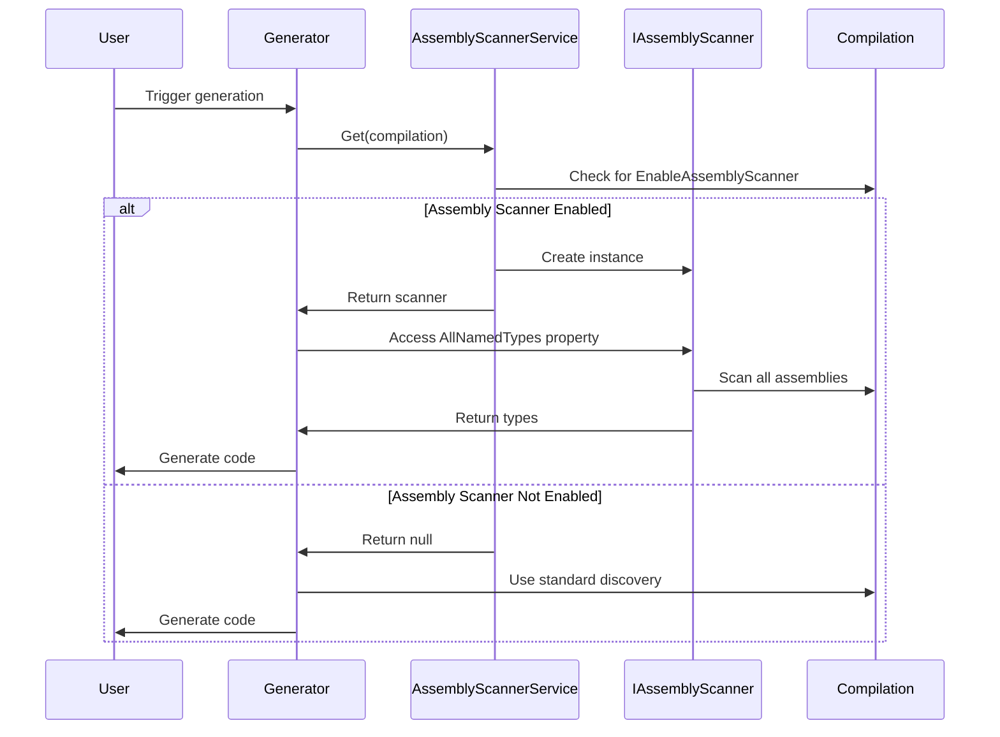

# FractalDataWorks Assembly Scanner Guide

## Table of Contents
- [Overview](#overview)
- [Architecture](#architecture)
- [Enabling Assembly Scanner](#enabling-assembly-scanner)
- [Using in Generators](#using-in-generators)
- [Testing Assembly Scanner](#testing-assembly-scanner)
- [Examples](#examples)

## Overview

The Assembly Scanner feature enables cross-assembly type discovery in Roslyn source generators. This allows generators to find and process types from referenced assemblies, not just the current compilation.

### Key Features
- Cross-assembly type discovery
- Opt-in mechanism for performance
- Cached scanner instances per compilation
- Support for attribute-based type filtering

## Architecture

### Sequence Diagram



### Components

1. **EnableAssemblyScannerAttribute** - Marker attribute to enable scanning
2. **AssemblyScannerService** - Service locator for scanner instances
3. **IAssemblyScanner** - Interface for type discovery operations
4. **AssemblyScanner** - Default implementation

## Enabling Assembly Scanner

### In Target Projects

Add the attribute at the assembly level:

```csharp
[assembly: FractalDataWorks.SmartGenerators.EnableAssemblyScanner]
```

Or in a global usings file:

```csharp
// GlobalUsings.cs
global using FractalDataWorks.SmartGenerators;

[assembly: EnableAssemblyScanner]
```

### Conditional Enabling

```csharp
#if ENABLE_ASSEMBLY_SCANNING
[assembly: EnableAssemblyScanner]
#endif
```

## Using in Generators

### Basic Usage

```csharp
[Generator]
public class CrossAssemblyGenerator : IncrementalGeneratorBase<TypeInfo>
{
    protected override TypeInfo? TransformSyntax(GeneratorSyntaxContext context)
    {
        var compilation = context.SemanticModel.Compilation;
        var scanner = AssemblyScannerService.Get(compilation);
        
        if (scanner == null)
        {
            // Fall back to standard compilation-only discovery
            return null;
        }
        
        // Use scanner for cross-assembly discovery
        var allTypes = scanner.AllNamedTypes;
        var targetTypes = allTypes
            .Where(t => t.GetAttributes()
                .Any(a => a.AttributeClass?.Name == "ProcessAttribute"));
        
        // Process discovered types
        foreach (var type in targetTypes)
        {
            // Generate code for type
        }
        
        return new TypeInfo { /* ... */ };
    }
}
```

### Finding Types by Attribute

```csharp
public IEnumerable<INamedTypeSymbol> FindTypesWithAttribute(
    IAssemblyScanner scanner, 
    string attributeName)
{
    return scanner.AllNamedTypes
        .Where(type => type.GetAttributes()
            .Any(attr => attr.AttributeClass?.Name == attributeName));
}
```

### Finding Implementations

```csharp
public IEnumerable<INamedTypeSymbol> FindImplementations(
    IAssemblyScanner scanner,
    INamedTypeSymbol interfaceSymbol)
{
    return scanner.AllNamedTypes
        .Where(type => !type.IsAbstract && 
                      type.AllInterfaces.Contains(interfaceSymbol));
}
```

## Testing Assembly Scanner

### Test Setup

```csharp
public class AssemblyScannerTests
{
    private Compilation CreateCompilationWithScanner(params string[] sources)
    {
        var compilation = CreateCompilation(sources);
        
        // Add assembly attribute
        var attributeSource = "[assembly: FractalDataWorks.SmartGenerators.EnableAssemblyScanner]";
        compilation = compilation.AddSyntaxTrees(
            CSharpSyntaxTree.ParseText(attributeSource));
        
        return compilation;
    }
}
```

### Testing Type Discovery

```csharp
[Fact]
public void ScannerFindsTypesAcrossAssemblies()
{
    // Arrange
    var lib1 = @"
        namespace Lib1
        {
            [MyAttribute]
            public class Class1 { }
        }";
    
    var lib2 = @"
        namespace Lib2
        {
            [MyAttribute]
            public class Class2 { }
        }";
    
    var main = @"
        [assembly: EnableAssemblyScanner]
        
        namespace Main
        {
            [MyAttribute]
            public class MainClass { }
        }";
    
    // Create compilation with references
    var lib1Compilation = CreateCompilation(lib1);
    var lib2Compilation = CreateCompilation(lib2);
    
    var mainCompilation = CreateCompilation(main)
        .AddReferences(lib1Compilation.ToMetadataReference())
        .AddReferences(lib2Compilation.ToMetadataReference());
    
    // Act
    var scanner = AssemblyScannerService.Get(mainCompilation);
    var types = scanner?.AllNamedTypes
        .Where(t => t.GetAttributes()
            .Any(a => a.AttributeClass?.Name == "MyAttribute"))
        .ToList();
    
    // Assert
    scanner.ShouldNotBeNull();
    types.ShouldNotBeNull();
    types.Count.ShouldBe(3);
    types.ShouldContain(t => t.Name == "Class1");
    types.ShouldContain(t => t.Name == "Class2");
    types.ShouldContain(t => t.Name == "MainClass");
}
```

### Testing Generator with Scanner

```csharp
[Fact]
public void GeneratorUsesAssemblyScannerWhenEnabled()
{
    // Arrange
    var referencedSource = @"
        namespace Referenced
        {
            [GenerateFor]
            public class ReferencedClass { }
        }";
    
    var mainSource = @"
        [assembly: EnableAssemblyScanner]
        
        namespace Main
        {
            [GenerateFor]
            public class MainClass { }
        }";
    
    // Create referenced assembly
    var referencedCompilation = CreateCompilation(referencedSource);
    var referencedAssembly = referencedCompilation.ToMetadataReference();
    
    // Act
    var generator = new MyGenerator();
    var output = SourceGeneratorTestHelper.RunGenerator(
        generator,
        new[] { mainSource },
        out var diagnostics,
        referencedAssembly);
    
    // Assert
    output.Count.ShouldBe(2);
    output.Keys.ShouldContain(k => k.Contains("ReferencedClass"));
    output.Keys.ShouldContain(k => k.Contains("MainClass"));
}
```

### Testing Scanner Caching

```csharp
[Fact]
public void ScannerIsCachedPerCompilation()
{
    // Arrange
    var compilation = CreateCompilationWithScanner("class Test { }");
    
    // Act
    var scanner1 = AssemblyScannerService.Get(compilation);
    var scanner2 = AssemblyScannerService.Get(compilation);
    
    // Assert
    scanner1.ShouldBeSameAs(scanner2);
}
```

## Examples

### Enhanced Enum Cross-Assembly Scanning

```csharp
[Generator]
public class EnhancedEnumGenerator : IncrementalGeneratorBase<EnumTypeInfo>
{
    protected override EnumTypeInfo? TransformSyntax(GeneratorSyntaxContext context)
    {
        if (context.Node is not EnumDeclarationSyntax enumDecl)
            return null;
        
        var symbol = context.SemanticModel.GetDeclaredSymbol(enumDecl);
        if (symbol == null) return null;
        
        // Check for enhanced enum attribute
        var hasAttribute = symbol.GetAttributes()
            .Any(a => a.AttributeClass?.Name == "EnhancedEnumAttribute");
        
        if (!hasAttribute)
        {
            // Check if this enum is referenced by enhanced enums in other assemblies
            var compilation = context.SemanticModel.Compilation;
            var scanner = AssemblyScannerService.Get(compilation);
            
            if (scanner != null)
            {
                var enhancedEnums = scanner.AllNamedTypes
                    .Where(t => t.TypeKind == TypeKind.Enum)
                    .Where(t => t.GetAttributes()
                        .Any(a => a.AttributeClass?.Name == "EnhancedEnumAttribute"));
                
                // Check if any enhanced enum references this enum
                hasAttribute = enhancedEnums.Any(e => 
                    ReferencesEnum(e, symbol));
            }
        }
        
        return hasAttribute ? CreateEnumInfo(symbol) : null;
    }
}
```

### Service Registration Scanner

```csharp
[Generator]
public class ServiceRegistrationGenerator : IIncrementalGenerator
{
    public void Initialize(IncrementalGeneratorInitializationContext context)
    {
        context.RegisterPostInitializationOutput(ctx =>
        {
            // Register marker attribute
            ctx.AddSource("ServiceAttribute.g.cs", @"
                namespace FractalDataWorks.DependencyInjection
                {
                    [AttributeUsage(AttributeTargets.Class)]
                    public class ServiceAttribute : Attribute
                    {
                        public Type? ServiceType { get; set; }
                        public ServiceLifetime Lifetime { get; set; }
                    }
                }");
        });
        
        var provider = context.CompilationProvider;
        
        context.RegisterSourceOutput(provider, (spc, compilation) =>
        {
            var scanner = AssemblyScannerService.Get(compilation);
            if (scanner == null) return;
            
            // Find all services across assemblies
            var services = scanner.AllNamedTypes
                .SelectMany(type => type.GetAttributes()
                    .Where(a => a.AttributeClass?.Name == "ServiceAttribute")
                    .Select(a => new { Type = type, Attribute = a }))
                .ToList();
            
            if (!services.Any()) return;
            
            // Generate registration code
            var code = GenerateServiceRegistrations(services);
            spc.AddSource("ServiceRegistrations.g.cs", code);
        });
    }
}
```

### Plugin Discovery

```csharp
public class PluginDiscoveryGenerator : IncrementalGeneratorBase<PluginInfo>
{
    protected override void RegisterSourceOutput(
        IncrementalGeneratorInitializationContext context,
        IncrementalValuesProvider<PluginInfo?> syntaxProvider)
    {
        // Also register compilation-wide output for plugin manifest
        context.RegisterSourceOutput(
            context.CompilationProvider,
            GeneratePluginManifest);
    }
    
    private void GeneratePluginManifest(
        SourceProductionContext context,
        Compilation compilation)
    {
        var scanner = AssemblyScannerService.Get(compilation);
        if (scanner == null) return;
        
        // Find all plugin implementations
        var pluginInterface = compilation.GetTypeByMetadataName("IPlugin");
        if (pluginInterface == null) return;
        
        var plugins = scanner.AllNamedTypes
            .Where(t => !t.IsAbstract)
            .Where(t => t.AllInterfaces.Contains(pluginInterface))
            .ToList();
        
        var manifest = GenerateManifestCode(plugins);
        context.AddSource("PluginManifest.g.cs", manifest);
    }
}
```

## Performance Considerations

1. **Opt-in by Design** - Scanner only runs when explicitly enabled
2. **Compilation Caching** - Scanner instances are cached per compilation
3. **Type Filtering** - Filter types early to minimize processing
4. **Lazy Evaluation** - Use LINQ for deferred execution

## Best Practices

1. **Always Check for Null** - Scanner may not be available
2. **Provide Fallback** - Have compilation-only logic as backup
3. **Cache Results** - Store discovered types if used multiple times
4. **Filter Early** - Reduce the type set as soon as possible
5. **Test Both Scenarios** - Test with and without scanner enabled

## Future Extensions

Potential future enhancements:
- Assembly filtering options
- Parallel type discovery
- Incremental assembly scanning
- Type relationship caching
- Custom scanner implementations

## License

Licensed under the Apache License 2.0.